# Enhanced Windows Server 2019 Setup Project Guide

## Introduction
This document serves as a comprehensive guide for setting up a Windows Server 2019 environment in VMware, tailored for a small software company with 9 employees. It incorporates detailed instructions from the original project guide provided in Icelandic, translated and structured for clarity and ease of use.

---

## Chapter 1: Windows Installation and Basic Settings (20%)

### 1.1 Windows 10 Setup
- **Actions Taken**:
  - Set up a new Windows 10 installation on the computer.
  - Choose **Setup for organization** and **Domain join instead** options during the setup.
  - *What I did in this part was that I installed windows server 2019 on VMware in my laptop after reassembling a computer in class and installing windows 10 on that computer. I used VMware as an emulator so i can finish the rest of these steps in my own laptop computer. At this point I have made and finished other assignments in my class and delivered them to INNA school system. From this point on I will continue to work on my emulated windows on VMware.*

---

### 1.2 Computer Name Configuration
- **Actions Taken**:
  - Change the computer name to `KEST2VW-[YourName]`, avoiding Icelandic characters and spaces.
  - *Changed the computer name to `KEST2VW-[HreidarPetursson]`*

#### Images/Screenshots
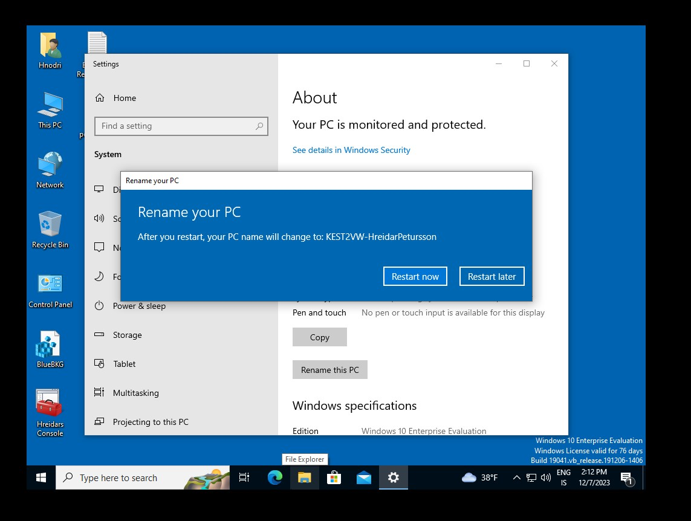

---

### 1.3 Software Installation
- **Actions Taken**:
  - Install Python3 (64-bit) and Visual Studio Code (VS Code) with Python support.
  - Install Git and any other software required.

- **My Comments**
  - *I have installed GIT and VSCode, installed extensions to the VSCode for the python various supports and I of course installed python directly onto the computer. See shortcuts on the desktop from screenshot.*

#### Images/Screenshots
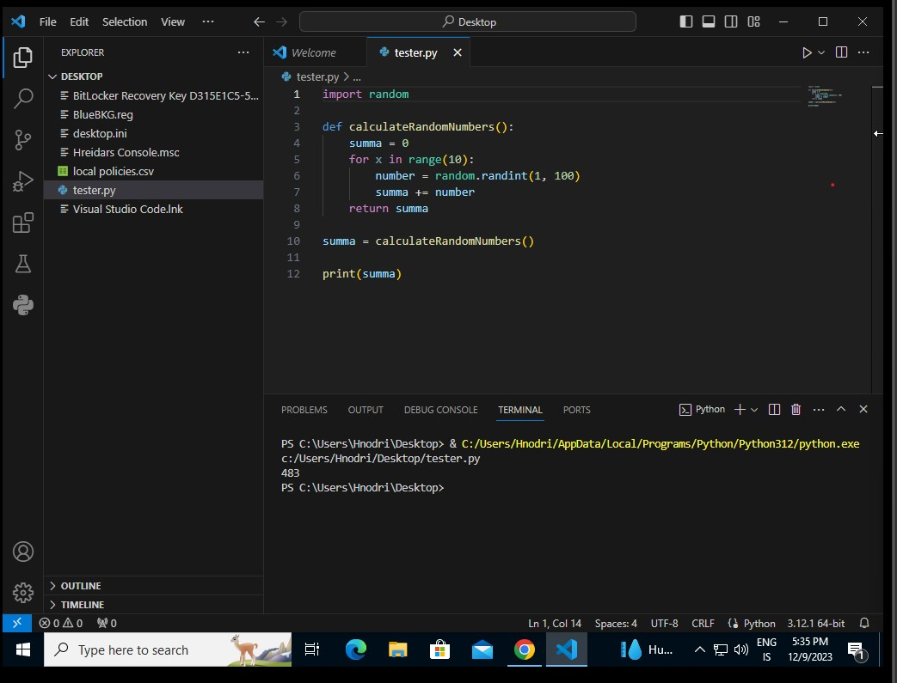
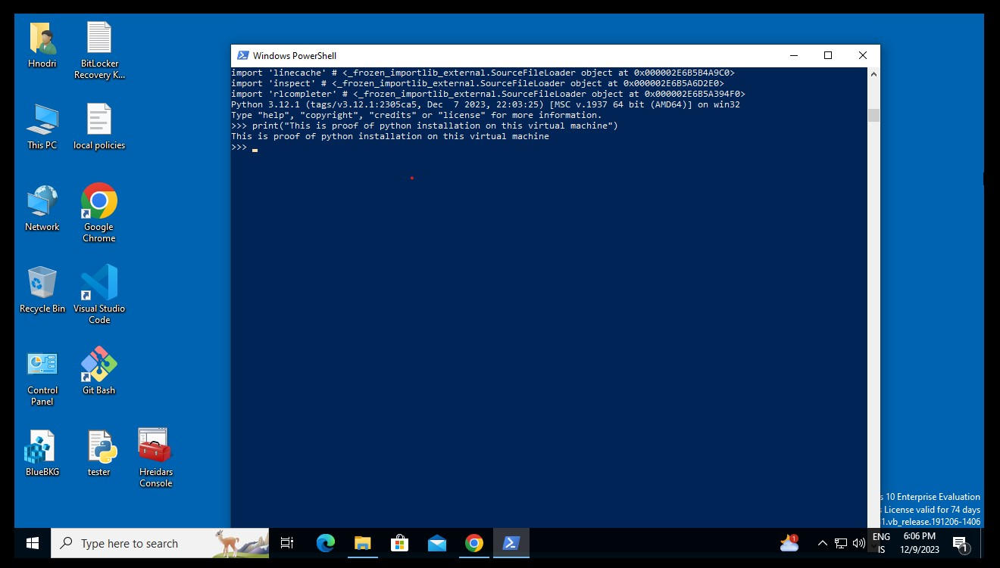

---

## Chapter 2: Users (20%)

### 2.1 Creating User Groups
- **Actions Taken**:
  - Create user groups named `Innkaup`, `Sala`, `Yfirstjórn`, and `Allir`.
  - Ensure each employee is a member of one departmental group and also in the `Allir` group.

- **My Comments**
  - *I used "compmgmt.msc and navigated to the local users and groups computer management source and added 4 new groups. Groups Allir, Innkaup, Sala and Yfirstjórn*

#### Images/Screenshots
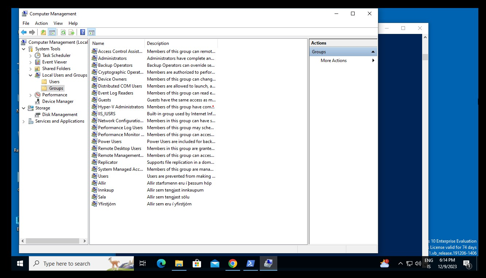

---

### 2.2 PowerShell Script for User Creation
- **Actions Taken**:
  - Write a PowerShell script to create user accounts based on the data in [this CSV file](https://raw.githubusercontent.com/gestskoli/KEST2VW/master/Annad/notendur.csv).
  - The script should set passwords for the users and add them to the respective groups created earlier, including the `Allir` group.
  - Ensure that all users are able to log in.
  - Consider using [`Import-Csv`](https://docs.microsoft.com/en-us/powershell/module/microsoft.powershell.utility/import-csv?view=powershell-7) in PowerShell.

  - **My Comments**
  - *I found and researched alot of information about creating scripts for powershell and also used my knowledge of coding languagues for helping me to write this script. I used a for each loop to loop through each of the commands i found that i needed to use to create and also add the users to their corresponding groups and also each of them to the Allir group. See screenshots of the success of the script running and user creation.*

#### Images/Screenshots
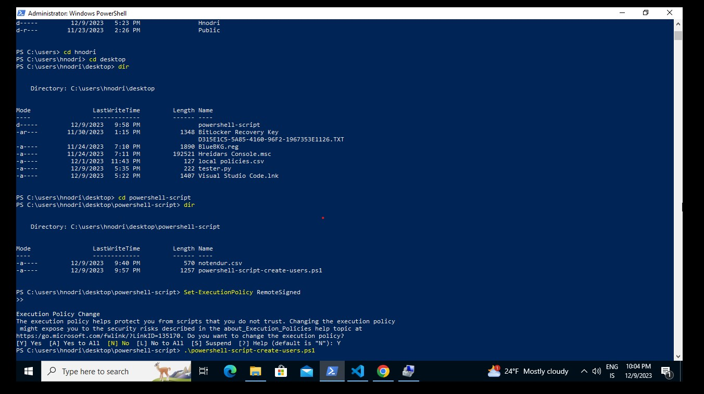
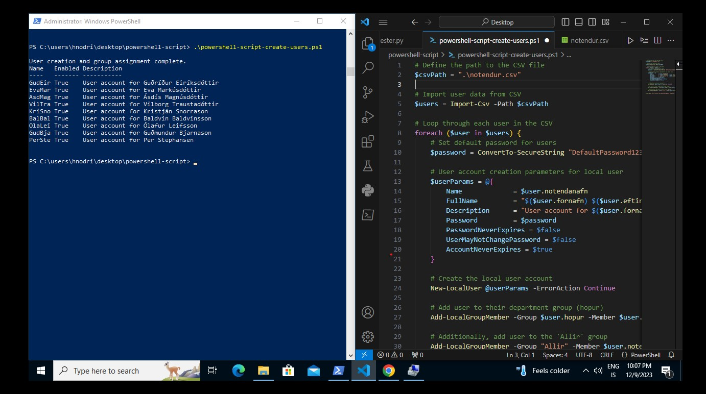
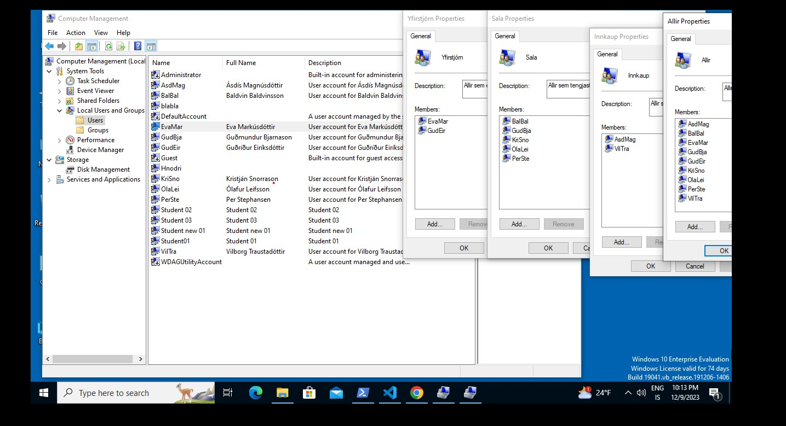

---

## Chapter 3: Files, Folders, and Permissions (20%)

### 3.1 Directory Structure and Permissions
- **Actions Taken**:
  - Create a directory named `Gögn` on the C drive root.
  - Inside `Gögn`, create folders for each user group and a shared folder named `Sameign`.
  - Set permissions for each folder and create a text file in each named after the folder.

- **My Comments**
  - *I experienced a little bit of problems when trying to log onto each account because i forgot to add each user to the Users group. But after that i could access each group and give them specific and full permissions to each folders `see screenshot`. *

#### Images/Screenshots
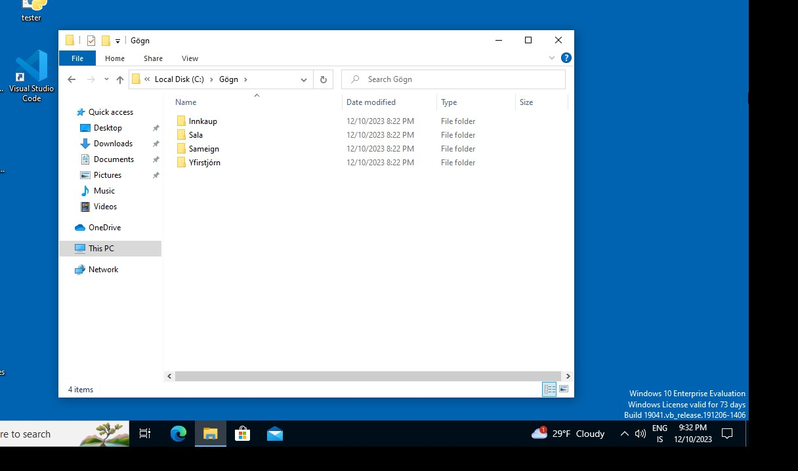
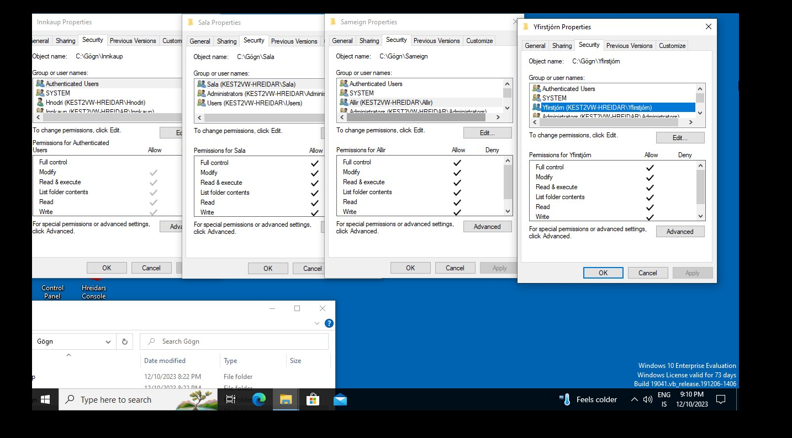

---

## Chapter 4: Security Matters (10%)

### 4.1 Password Policy
- **Actions Taken**:
  - Modify the password policy to require a minimum of 8 characters and disallow simple passwords.

- **My Comments**
  - *opened secpol.msc and go to account policies and then password policy and there change the minimum password length and password meet complexity requirements.*

#### Images/Screenshots
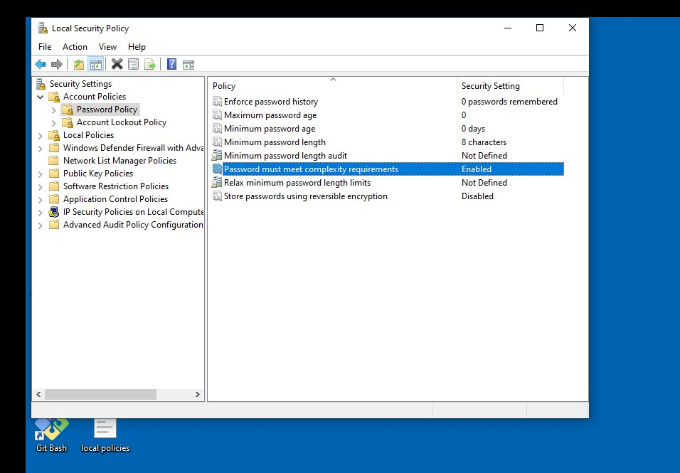

---

### 4.2 Firewall Configuration
- **Actions Taken**:
  - Configure the firewall to block all incoming network traffic except for ping requests.

- **My Comments**
  - *I opened wf.msc and from there added 2 new inbound rules. One for allowing ping request and other for blocking all inbound traffic. See the screenshot.*

#### Images/Screenshots
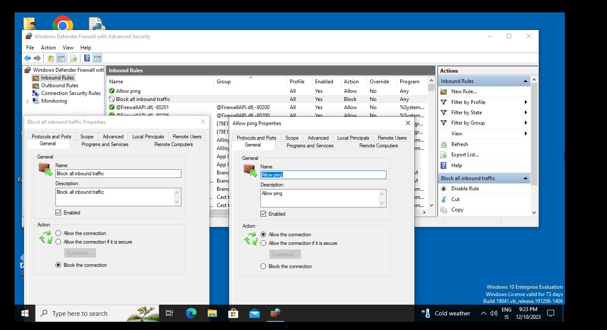

---

## Chapter 5: Networking (30%)

### 5.1 PacketTracer Assignment
- **Actions Taken**:
  - Complete the PacketTracer assignment provided [here](https://github.com/gestskoli/KEST2VW/raw/master/Annad/Lokaverkefni_V20.pka).
  - Optionally, practice with the PacketTracer exercise file [here](https://github.com/gestskoli/KEST2VW/raw/master/Annad/10.2.1.7%20Packet%20Tracer%20-%20Web%20and%20Email.pka).
  - *As of now i have still yet to finish this packet traces assignment and will probably do so as soon as possible. My apoligies for not bein able to finish the packet traces assignment on time.*

#### Images/Screenshots

---

## Conclusion
- **Overall Reflection**:
  - *First of all, I used the AI for helping me create a useful guide in english for this assignment but only to create a visually beautiful assignment for me to fill out. This gave me the opportunity to write like it being a diary of what i was doing and i took screenshots and added them for proof of what i did. I hope this is enough for you. This project helped me learned alot and I am grateful for the opportunity to be a better computer technician and learn more in the IT sector. The AI only created the guide but I did all the work and filled in what i did for each part of the assignment. The AI did not finish or do the assignment for me. I worked my ass off to get this sent in tonight.
  
  I will do the packet traces assignment tomorrow.*

  

---

