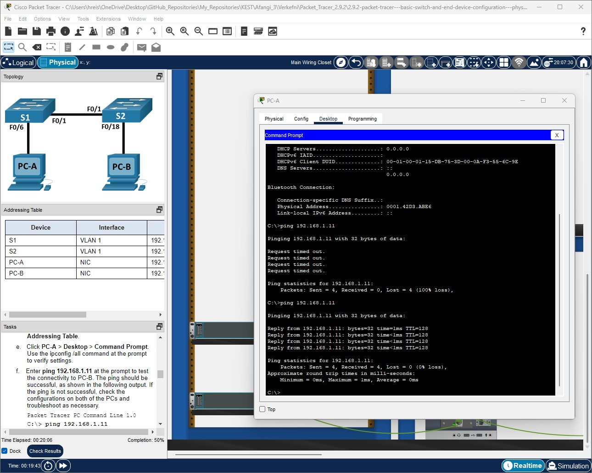
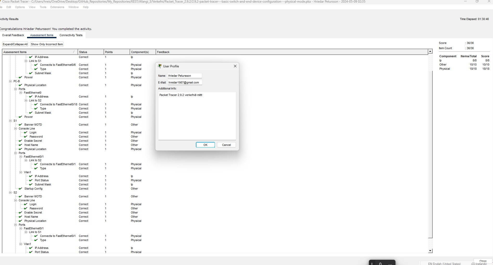
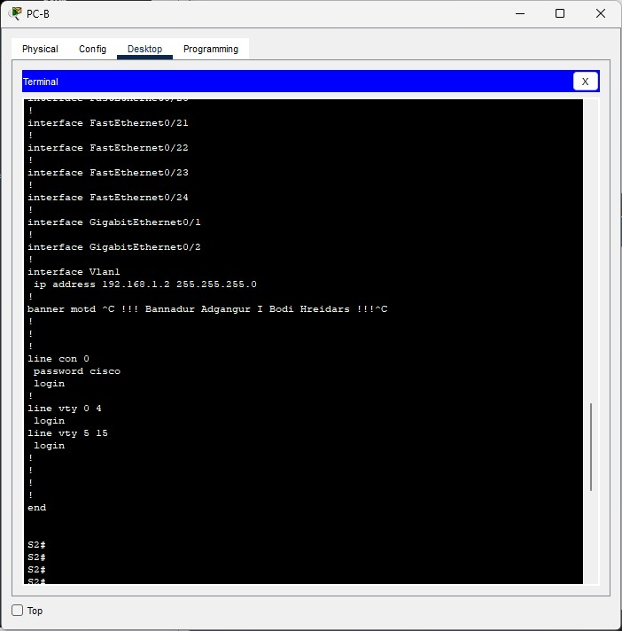
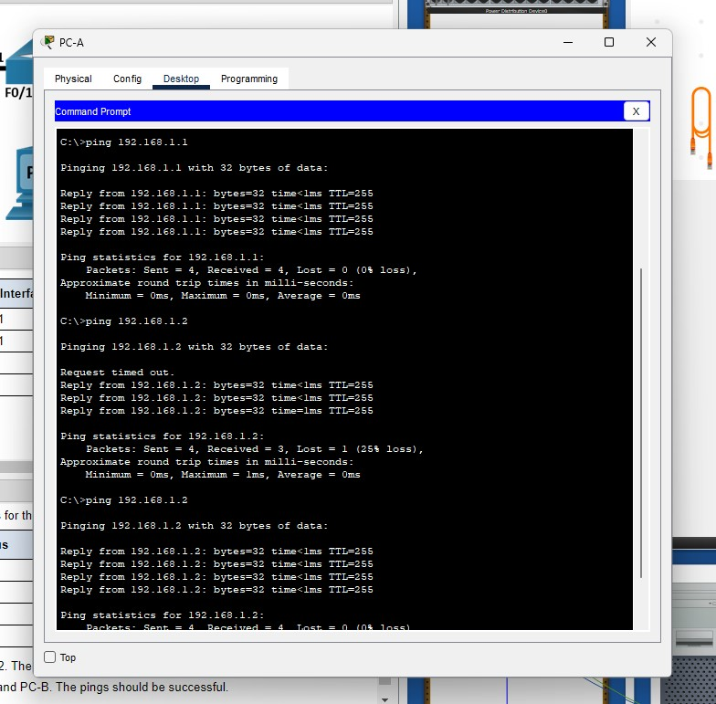
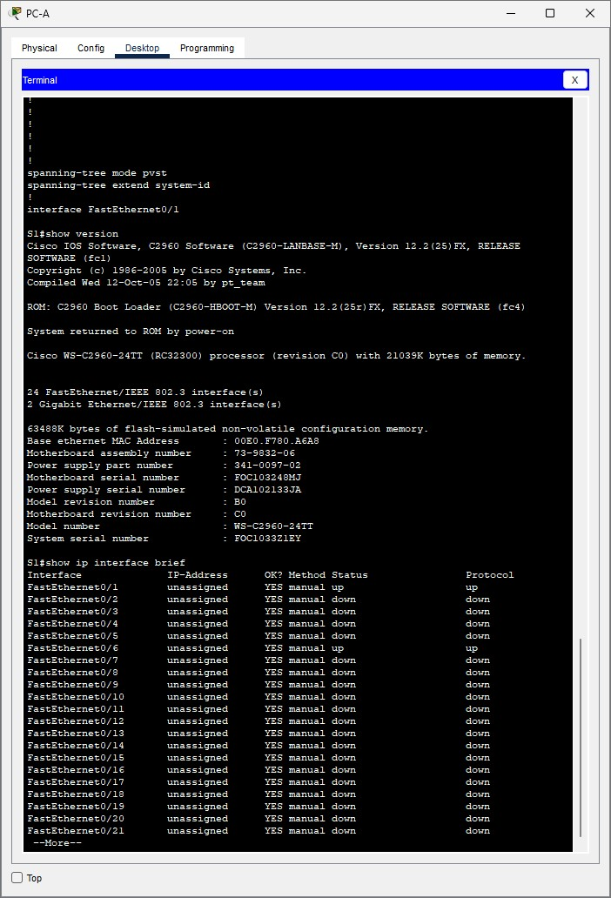

# Packet Tracer Assignment 2.9.2

## Table of Contents
1. [Overview](#overview)
2. [Objective](#objective)
3. [Devices Used In This Project](#devices-used-in-this-project)
4. [Design Of Project](#design-of-project)
5. [Configurations Made To Meet The Assignment's Requirements](#configurations-made-to-meet-the-assignments-requirements)
6. [More Detailed Configurations (If Needed)](#more-detailed-configurations-if-needed)
7. [Other Device Configurations](#other-device-configurations)
8. [Verification](#verification)
9. [Conclusion](#conclusion)
10. [Screenshots](#screenshots)

`---`

## Overview
In this chapter, we dive into setting up and configuring a network that includes switches and PCs, focusing on how these devices interact in a controlled environment and enhance our understanding of network management.

***

### Objective
This assignment sharpens our skills in configuring and verifying network settings, focusing on communication between devices using various protocols and preparing us for more complex networking tasks.

### Devices Used In This Project
We worked with **Switch S1 (Cisco 2960)**, **Switch S2 (Cisco 3650)**, **PC-A**, and **PC-B**. These devices are fundamental in bringing our simulated network to life and demonstrating practical networking principles.

### Design Of Project
The design is straightforward yet sophisticated, with routers and switches configured to ensure smooth data flow. Each device plays a critical role in managing traffic between network segments and ensuring data reaches its destination securely and efficiently.

### Configurations Made To Meet The Assignment's Requirements
We kicked off by setting up the network topology in Packet Tracer:
- Connected PC-A to Switch S1 and PC-B to Switch S2.
- Ensured all devices were powered on and properly connected.
- Configured necessary IP addresses and subnet masks on PCs and switches.

### More Detailed Configurations (If Needed)
We delved deeper into configurations for the switches:
- Set up VLAN configurations to segment the network logically.
- Enabled Spanning Tree Protocol (STP) to prevent network loops, ensuring stable and reliable network communication.

### Other Device Configurations
- Configured basic switch settings including assigning switch names based on the addressing table, setting up console and privileged EXEC passwords, and configuring an SVI for VLAN 1 on each switch.

### Verification
To ensure everything was working as expected, we tested network connectivity using the ping command across devices. It was essential to verify that data packets were moving correctly without any issues.

### Conclusion
This project greatly enhanced my understanding of how different network devices interact and the importance of precise configurations. It's incredibly rewarding to see theoretical knowledge applied in practical scenarios.

## Screenshots
Here are some snapshots taken during the project, showing crucial steps and successful completions.

"Testing connectivity between devices with ping command."

"Completion status showing successful configuration and connection."

"Checking the running configuration on PC-B."

"Pinging from PC-A to switches to verify network paths."

"Terminal output on PC-A showing detailed network status."
