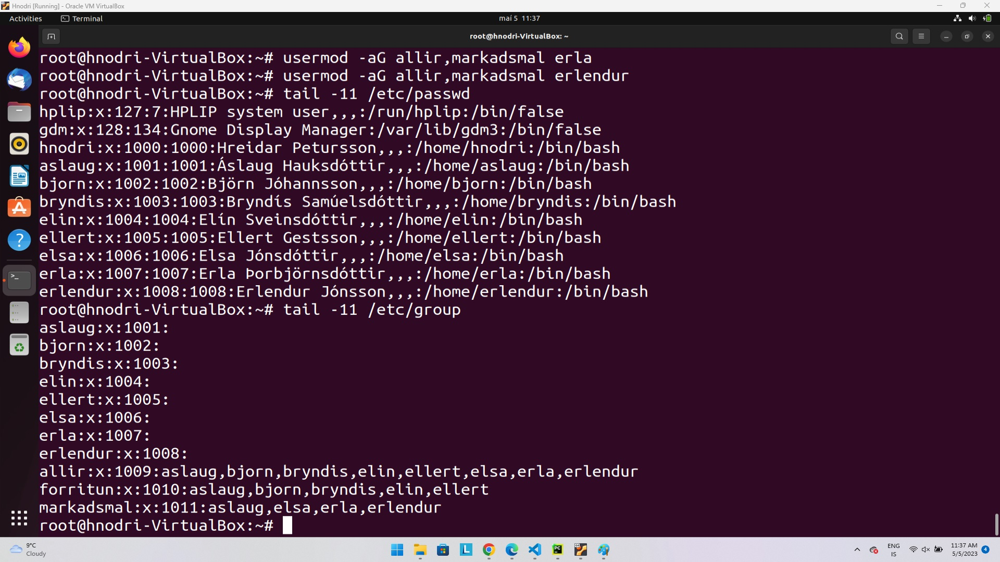
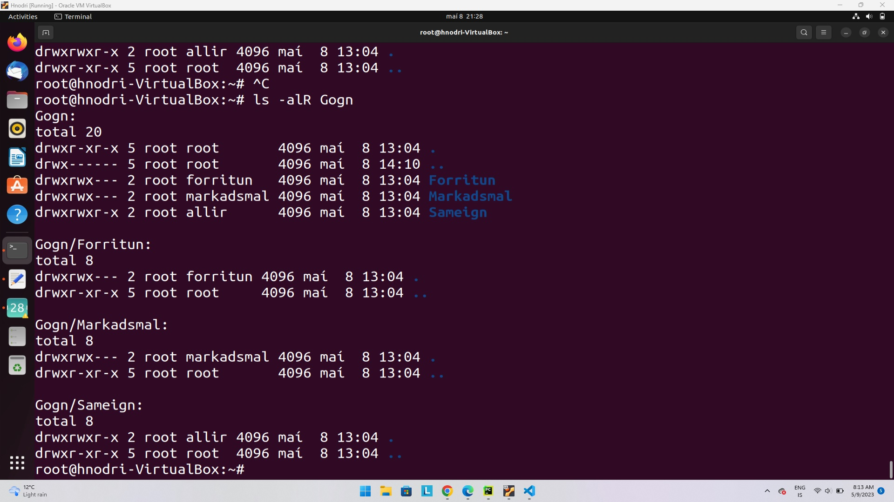
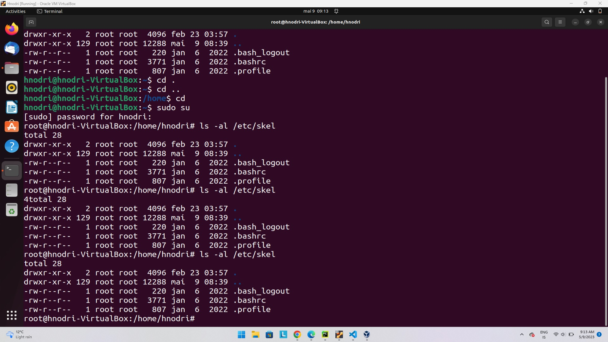

Lokaverkefni í KEST áfanga
---
Í þessu lokaverkefni er ég að vinna á Ubuntu kerfinu sem er installað á Virtual Machine.
---
# 1. Fyrsti dagurinn
   - A. Ég bjó til notendur með useradd skipun. Gerði 8 notendur.
   - B. Bjó til grúppur með groupadd skipun.
   - C. Setti notendur sem ég gerði í grúppur með usermod -aG skipun.
    
---
# 2. Held áfram með verkefnið
   - A. Ég skilgreindi hópana forritun og markadsmal sem group hlutinn af réttindum.
   - B. Ég setti réttindi á möppurnar Gogn/Forritun og Gogn/Markadsmal.
   - C. Passaði upp á að aðrir en þeir sem eru í hópnum hafi ekki aðgang.
   - D. Gerði möppurnar Vinna og Leikir inná hverjum notanda.
   - E. Gerði linka á þrjár aðal möppurnar inná hverjum notanda.
   - F. Tryggði að notendur geti eingöngu eytt sínum skrám úr möppunum.
   
---
# 3. Klára verkefnið
   - A. Læsti aðgöngum Erlends og Erlu.
   - B. Gerði Áslaugu að sudo.
   - C. Setti upp git og ssh lykil.
   - D. Skrifaði leiðbeiningarnar fyrir Áslaugu.
   


# prufa
```
   "Hérna verða leiðbeiningarnar fyrir áslaugu"
```