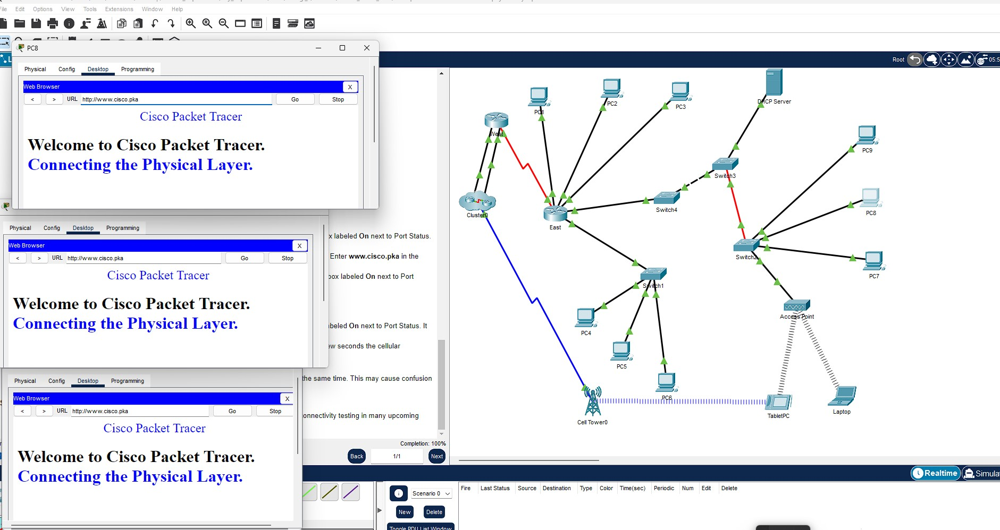
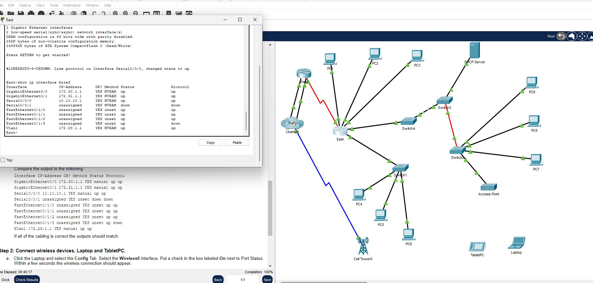
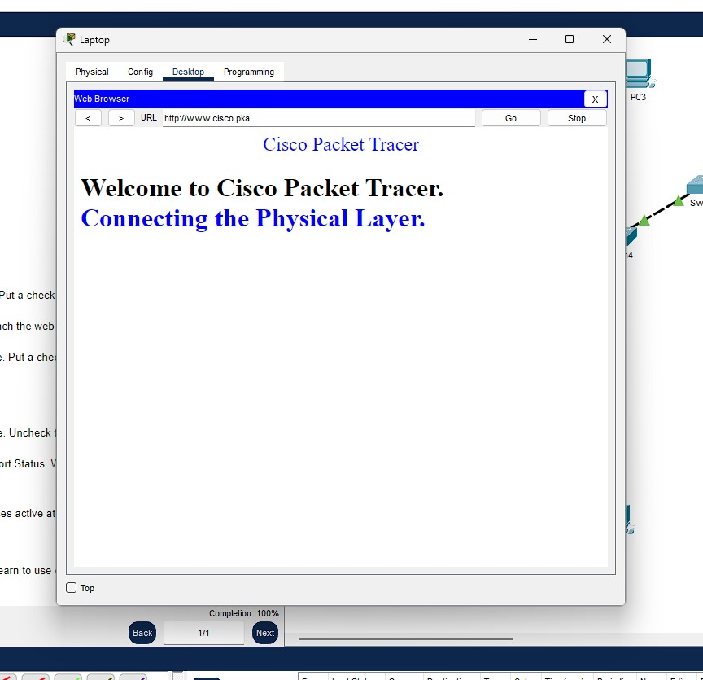
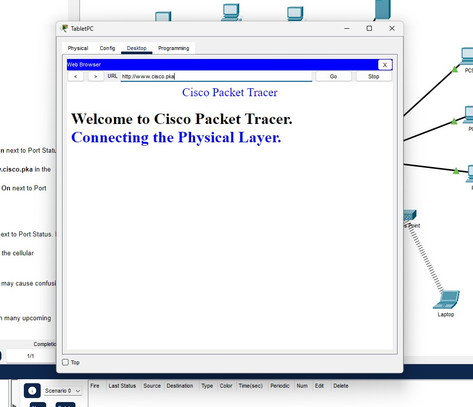

# Packet Tracer Assignment 4.7.2

## Table of Contents
1. [Overview](#overview)
2. [Objective](#objective)
3. [Devices Used In This Project](#devices-used-in-this-project)
4. [Design Of Project](#design-of-project)
5. [Configurations Made To Meet The Assignment's Requirements](#configurations-made-to-meet-the-assignments-requirements)
6. [Questions to Answer](#questions-to-answer)
7. [Verification](#verification)
8. [Conclusion](#conclusion)
9. [Screenshots](#screenshots)

## Overview
 - In this chapter, we delve into the complexities of connecting the physical layer in a simulated network environment, focusing on the identification, module selection, and connectivity of various internetworking devices using Cisco Packet Tracer.

***

### Objective
 - The objective of this assignment is to explore different options available on internetworking devices, identify the correct modules for connectivity, and effectively connect and check device interactions within a simulated network environment.

***

### Devices Used In This Project
 - **East Router (Cisco Router)**
 - **Switch2 (Cisco Switch)**
 - **Multiple PCs (PC1, PC2, PC3, etc.)**
 - These devices are integral to understanding the physical and logical interactions in network setups.

***

### Design Of Project
 - The design focuses on identifying the physical characteristics of devices, selecting and inserting appropriate modules for connectivity, and establishing connections between devices to simulate an operational network.

***

### Configurations Made To Meet The Assignment's Requirements
 
 - **Identification of Ports and Interfaces:**
    * Management, LAN, and WAN ports on the East router.
    * Module expansion capabilities of the East router and Switch2.
 - **Module Selection and Installation:**
    * Selection of appropriate modules to connect multiple PCs directly to the East router.
    * Installation of modules in Switch2 to provide a Gigabit optical connection.

***

### Questions to Answer
 
 - **Identify Management Ports:**
    * Which management ports are available on the East router?
    - **Answer:** 
        - The typical management ports on a Cisco router include the Console and Auxiliary ports.
 
 - **Identify LAN and WAN Interfaces:**
    * Which LAN and WAN interfaces are available on the East router and how many are there?
    - **Answer:** 
        - The East router has GigabitEthernet interfaces for LAN connectivity and Serial interfaces for WAN connectivity. Specific numbers can vary based on the model.
    
    * How many physical interfaces are listed on the East router?
        - **Answer:** 
            - There are 4 physical interfaces and 1 virtual.
    
    * What is the default bandwidth of the GigabitEthernet and Serial interfaces on the East router?
    - **Answers:** 
        - GigabitEthernet0/0: 1000 Mbps (1 Gbps), though the interface is configured to operate at 100 Mbps.
        - Serial0/0/0: 1544 Kbps (1.544 Mbps).
 
 - **Module Expansion Slots:**
    * How many expansion slots are available to add additional modules to the East router and Switch2?
    - **Answer:** 
        - There are 4 link slots available to expansion the switch2.
 
 - **Module Connectivity:**
    * Which module can be used to connect PCs 1, 2, and 3 to the East router?
        - **Answer:** HWIC-4ESW which contains the 4 links connections or lan connections.
    * How many hosts can you connect to the router using this module?
        - **Answer:** If using a HWIC-4ESW, up to four hosts can be connected.
    * Which module can you insert to provide a Gigabit optical connection to Switch3?
        - **Answer:** A module like the GLC-LH-SMD can provide a Gigabit optical connection if the device supports it.

***

### Verification
 - After configuring the devices and establishing connections, use the `show ip interface brief` command to verify interface status and connectivity across all connected devices.

***

### Conclusion
 - This assignment enhances practical skills in network setup and troubleshooting, emphasizing the importance of accurate hardware configuration and connectivity in network operations.

***

---

___

## Screenshots
 - Screenshots from the Packet Tracer, documenting key steps, to very results.
 
"Showing All PC's Working."

 
"Connection Cables & Show ip inteface brief command display."

 
"Working browser og the laptop"

 
"Working browser of the tablet pc."