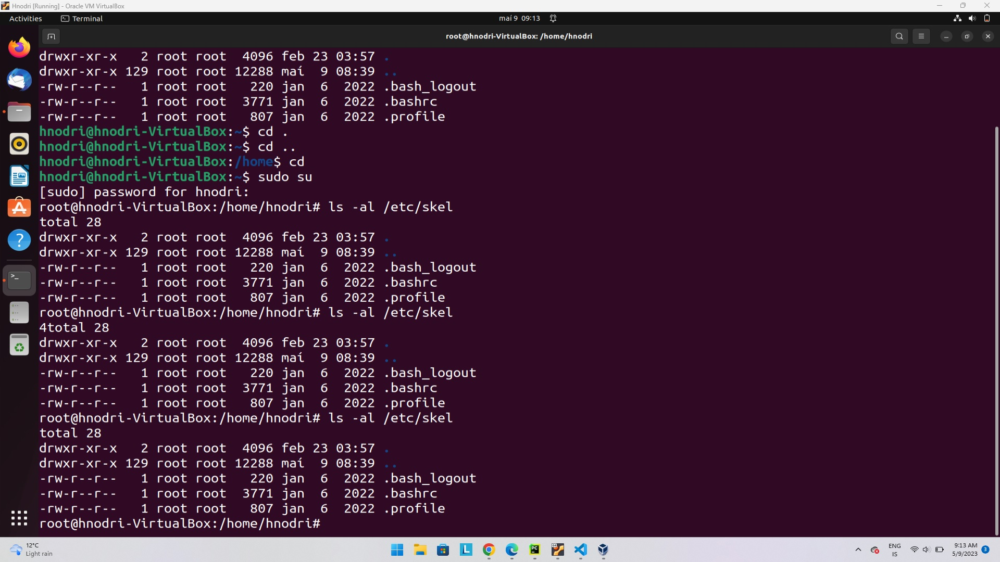

Lokaverkefni í KEST áfanga

---

Í þessu lokaverkefni er ég að vinna á Ubuntu kerfinu sem er installað á Virtual Machine.

---

# 1. Fyrsti dagurinn
   - A. Ég bjó til notendur með useradd skipun. Gerði 8 notendur.
   - B. Bjó til grúppur með groupadd skipun.
   - C. Setti notendur sem ég gerði í grúppur með usermod -aG skipun.
    

---

# 2. Held áfram með verkefnið
   - A. Ég skilgreindi hópana forritun og markadsmal sem group hlutinn af réttindum.
   - B. Ég setti réttindi á möppurnar Gogn/Forritun og Gogn/Markadsmal.
   - C. Passaði upp á að aðrir en þeir sem eru í hópnum hafi ekki aðgang.
   - D. Gerði möppurnar Vinna og Leikir inná hverjum notanda.
   - E. Gerði linka á þrjár aðal möppurnar inná hverjum notanda.
   - F. Tryggði að notendur geti eingöngu eytt sínum skrám úr möppunum.
   

---

# 3. Klára verkefnið
   - A. Læsti aðgöngum Erlends og Erlu.
   - B. Gerði Áslaugu að sudo.
   - C. Setti upp git og ssh lykil.
   - D. Skrifaði leiðbeiningarnar fyrir Áslaugu.
   


# Leiðbeiningar fyrir Áslaugu
```
   Sæl Áslaug, hérna eru leiðbeiningar hvernig skal búa til nýjan notanda, setja aðila í grúbbu, breyta réttindum hans, krefjast lykilorðsbreytingar, setja möppur og link inná heimasvæði notanda og hvernig skal virkja aðganga.

   1. Að búa til nýjan notanda er skipunin "sudo adduser notandanafn"
      - Þá er spurt um lykilorð, nafn og þess háttar.

   2. Næst skal krefjast þess að nýtt lykilorð sé slegið inn við innskráningu. Það er gert með skipuninni "sudo chage -d 0 notandanafn" eða "sudo passwd --expire notendanafn"

   3. Næst skal láta notanda í hóp. Gert með skipun "sudo usermod -aG hópur notandanafn".
      - Til að búa til nýjan hóp: "sudo groupadd hópnafn"

   4. Að bæta notanda í hóp: "sudo usermod -aG hópnafn notandanafn"
      - til að breyta réttindum á hóp á möppu er notað til dæmis "sudo chgrp hópur slóð-á-möppu"
      - til að breyta réttindum á möppu skal notað til dæmis: "sudo chmod 775 mappa" - fyrsta talan er eigandi, seinni talan er hópurinn, síðasta talan er allir aðrir. Skoðaðu netið til að vita meira.

   5. Til að bæta möppu inná heimasvæði skaltu nota: "sudo mkdir /home/notandanafn/nafnamoppu"
    - til að gefa viðkomandi réttindin á möppunni sinni notaru: "sudo chown notendanafn:notendanafn slóðámöppu"

   6. Til að gera linka inná heimasvæði notanda notaru: "ln -s slóðmöppu slóðnotanda" (slóð notanda til dæmis /home/notandi)

   7. Til þess að virkja aðganga Erlu og Erlends notaru skipun: "sudo passwd -u notandi"


   Gangi þér vel
```